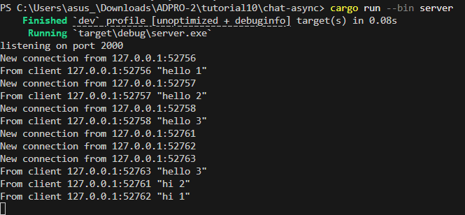
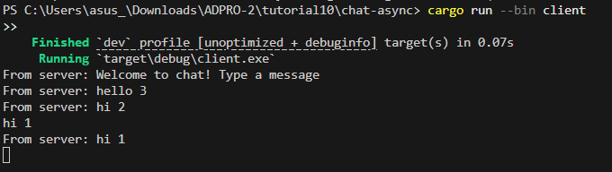
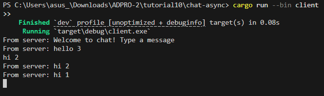
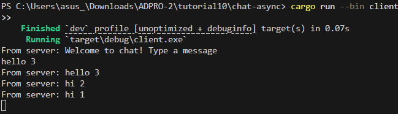
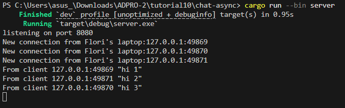
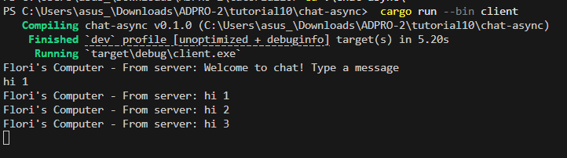
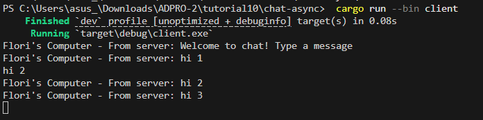
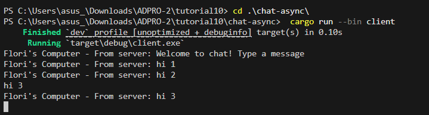

# Advanced Programming Module 10
## Reflection

### Experiment 2.1:

#### Running the server

#### Running client 1

#### Running client 2

#### Running client 3

To run this code, I open four terminals first. Then I put in `cargo run --bin server` in one terminal and `cargo run --bin client` in 3 terminals. I type 'hello' or 'hi' from each of the client terminals. The server listens for incoming TCP connections, upgrades them to websocket connections, and uses a broadcast channel to pass on messages from any client to all the clients.

### Experiment 2.2:
In the server, I changed the port to `TcpListener::bind("127.0.0.1:8080")`, and in the client, the connection URI I changed to `ws://127.0.0.1:8080`. The protocol is specified by the ws:// prefix in the URI, which both sides use for WebSocket communication. We just have to make sure both files already match in the port and protocol.

### Experiment 2.3:
#### Running server:

#### Running client 1:

#### Running client 2:

#### Running client 3:

All I did was modify this bit in client.rs: 
 `if let Some(text) = msg.as_text() {println!("Flori's Computer - From server: {}", text);}`
This labels every message received from the server.

And I also added this bit in server.rs:
    `loop {
    let (socket, addr) = listener.accept().await?;
    println!("New connection from Flori's laptop:{addr:?}");`
Putting this inside the loop logs the address of each client connection, so it's easier to see which clients are connecting to the server. 